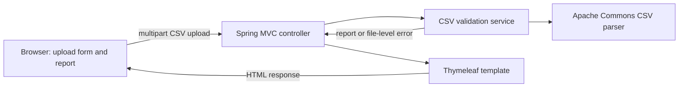

# CSV Validator - Proposed Architecture

## Decision

Build a single Spring Boot web application using Java and Maven. Use a server-rendered Thymeleaf page for both the upload form and the validation report. Keep validation in a small application service, process each upload for the duration of its request, and do not add a database.

## Component Flow



## Responsibilities

- **Browser page:** Provides a file chooser and submit button; displays summary counts and row-level reasons returned by the server. No frontend framework or client-side validation logic is needed.
- **MVC controller:** Serves the upload page and accepts one file at a time. It enforces the `.csv` filename rule, returns clear file-level errors for missing or empty uploads, and maps multipart size-limit failures to a clear response. It calls validation only for eligible uploads.
- **CSV validation service:** Owns validation orchestration and business rules: required headers, required values, strict `YYYY-MM-DD` dates, trimmed and case-sensitive provider ID uniqueness, duplicate marking for every matching row, and report counts.
- **CSV parser:** Use Apache Commons CSV for comma-delimited UTF-8 records and quoted values. Reject malformed CSV and invalid UTF-8 at file level without partial results; reject missing required headers before row validation and ignore extra columns.
- **Report model:** Use simple immutable Java records or equivalent classes for a validation report and row errors. Keep results in request memory and pass them to the template; do not write uploaded content or reports to durable storage.
- **Thymeleaf template:** A single page can show the upload form, file-level errors, and the validation summary with row numbers and reasons.

## Suggested Project Layout

```text
src/main/java/.../
  CsvValidatorApplication.java
  web/CsvValidationController.java
  validation/CsvValidationService.java
  validation/ValidationReport.java
  validation/RowError.java
src/main/resources/templates/index.html
src/test/java/.../
  validation/CsvValidationServiceTest.java
  web/CsvValidationControllerTest.java
```

Keep parsing inside the validation service initially. Extract a dedicated parser component only if parsing behavior grows enough to justify the extra boundary.

## Request Lifecycle and Data Handling

1. The user submits one CSV file to the application.
2. Spring receives the multipart upload; the application does not save it to application-managed durable storage.
3. The service parses the file and creates the report in memory.
4. The controller renders the report in the response. The application keeps no upload or report history.

Enforce a 1 MiB per-file limit and set the multipart request limit above it to account for framing. Do not log CSV contents or row values. Multipart handling may use temporary request storage depending on server configuration; it must not be retained as application data.

## Maven Dependencies

- `spring-boot-starter-web` for Spring MVC and multipart upload handling.
- `spring-boot-starter-thymeleaf` for the minimal server-rendered page.
- Apache Commons CSV for CSV parsing.
- `spring-boot-starter-test` for JUnit 5 and Spring MVC test support.

No database, ORM, frontend framework, or separate API service is needed for this MVP.

## Test Strategy

- **JUnit service tests:** Required headers, missing and whitespace-only values, strict valid and invalid dates, provider ID trimming and case sensitivity, every row in a duplicate group, extra columns, and report count invariants.
- **Parser-focused tests:** Valid UTF-8, invalid UTF-8 rejection, quoted fields, malformed quoting, completely blank lines, and delimiter-only records.
- **Controller tests with MockMvc:** Verify valid reports, missing-file and missing-header errors, file-type rejection, the 1 MiB boundary, and file-level malformed/empty-input errors. Use a real integration test for multipart-limit exception mapping.
- Use small in-memory CSV fixtures; tests must not depend on a database or external services.

## Approved CSV Input Decisions

- Limit each uploaded file to 1 MiB. Configure the multipart request limit above the file limit to allow for request framing.
- Require a case-insensitive `.csv` filename extension and validate the uploaded content server-side; do not trust the browser-provided MIME type.
- Reject zero-byte or whitespace-only files, malformed CSV, and invalid UTF-8 at file level without partial row results. Header-only files produce zero-row reports; ignore completely blank physical lines and treat delimiter-only records as data rows.
- The current UTF-8 readers replace malformed byte sequences instead of rejecting them. The implementation must be brought into conformance with the canonical spec before TC-CV-024 can pass; the requirement and test expectation remain unchanged.