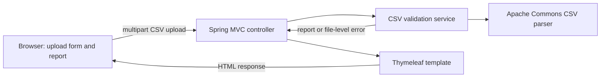

# CSV Validator - Proposed Architecture

## Decision

Build a single Spring Boot web application using Java and Maven. Use a server-rendered Thymeleaf page for both the upload form and the validation report. Keep validation in a small application service, process each upload for the duration of its request, and do not add a database.

## Component Flow



## Responsibilities

- **Browser page:** Provides a file chooser and submit button; displays summary counts and row-level reasons returned by the server. No frontend framework or client-side validation logic is needed.
- **MVC controller:** Serves the upload page and accepts one uploaded file. It handles request-level issues such as an empty upload or unsupported file type, calls the validation service, and returns the page with either a report or a clear file-level error.
- **CSV validation service:** Owns validation orchestration and business rules: required headers, required values, strict `YYYY-MM-DD` dates, trimmed and case-sensitive provider ID uniqueness, duplicate marking for every matching row, and report counts.
- **CSV parser:** Use Apache Commons CSV to parse comma-delimited UTF-8 records correctly, including quoted values. Reject missing required headers before row validation; ignore extra columns.
- **Report model:** Use simple immutable Java records or equivalent classes for a validation report and row errors. Keep results in request memory and pass them to the template; do not write uploaded content or reports to durable storage.
- **Thymeleaf template:** A single page can show the upload form, file-level errors, and the validation summary with row numbers and reasons.

## Suggested Project Layout

```text
src/main/java/.../
  CsvValidatorApplication.java
  web/CsvValidationController.java
  validation/CsvValidationService.java
  validation/ValidationReport.java
  validation/RowError.java
src/main/resources/templates/index.html
src/test/java/.../
  validation/CsvValidationServiceTest.java
  web/CsvValidationControllerTest.java
```

Keep parsing inside the validation service initially. Extract a dedicated parser component only if parsing behavior grows enough to justify the extra boundary.

## Request Lifecycle and Data Handling

1. The user submits one CSV file to the application.
2. Spring receives the multipart upload; the application does not save it to application-managed durable storage.
3. The service parses the file and creates the report in memory.
4. The controller renders the report in the response. The application keeps no upload or report history.

Configure an explicit maximum upload size before implementation. Do not log CSV contents or row values. Multipart handling may use temporary request storage depending on server configuration; it must not be retained as application data.

## Maven Dependencies

- `spring-boot-starter-web` for Spring MVC and multipart upload handling.
- `spring-boot-starter-thymeleaf` for the minimal server-rendered page.
- Apache Commons CSV for CSV parsing.
- `spring-boot-starter-test` for JUnit 5 and Spring MVC test support.

No database, ORM, frontend framework, or separate API service is needed for this MVP.

## Test Strategy

- **JUnit service tests:** Required headers, missing and whitespace-only values, strict valid and invalid dates, provider ID trimming and case sensitivity, every row in a duplicate group, extra columns, and report count invariants.
- **Parser-focused tests:** UTF-8 input and quoted CSV fields, including commas inside quoted values.
- **Controller tests with MockMvc:** Upload a valid CSV and observe the report page; verify missing-header and unsupported-file errors are rendered clearly.
- Use small in-memory CSV fixtures; tests must not depend on a database or external services.

## Decisions to Confirm Before Implementation

- Maximum accepted upload size.
- User-visible behavior for malformed CSV syntax, an empty file, and blank data records.
- Whether unsupported file types should be rejected based on the filename, parsed content, or both. The server should not rely only on a browser-provided content type.